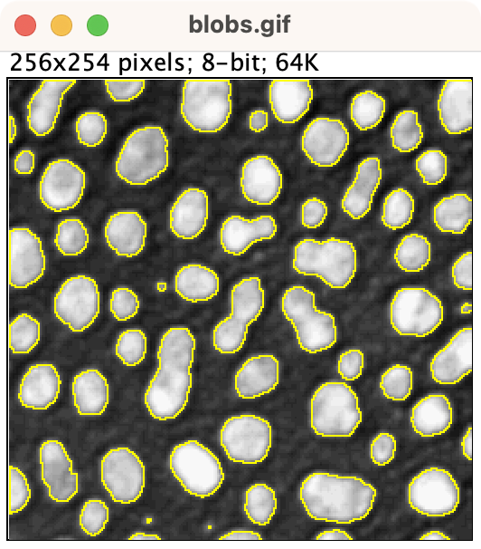
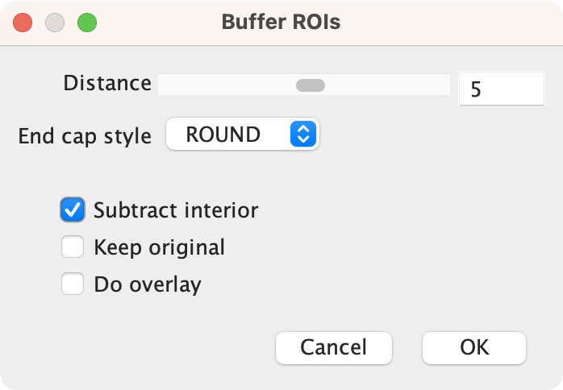
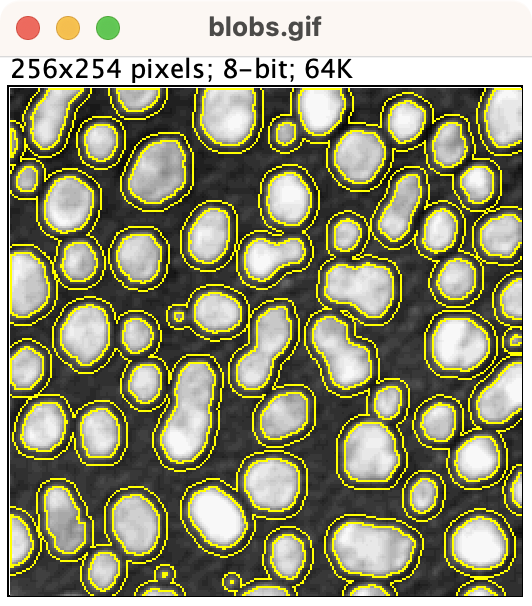

# IJTS Tools

This repo contains a *very* early and *very* rough implementation of **[Java Topology Suite](https://github.com/locationtech/jts)** (JTS) support for **[ImageJ](https://imagej.net)** (IJ).

One of the main uses is to **export and import ImageJ ROIs as [GeoJSON](https://geojson.org)**.

But it can be used for much more than that.

The code here helps translate between ImageJ `Roi` and JTS `Geometry` objects, which makes it possible to do lots more interesting things.

## Building

This currently works as a plugin compatible with ImageJ v1.x.

It has three dependencies:

* ImageJ
* Java Topology Suite
* Gson (for JSON support)

To build a single jar that bundles them all together, use

```bash
./gradlew shadowJar
```

## Installing

Once you have the plugin .jar file, it can be installed by drag & drop onto ImageJ/Fiji.

Alternatively, it can be copied to the 'plugins' directory of your ImageJ/Fiji installation.

## Using

### GeoJSON import/export

You can find the GeoJSON-related commands under *Plugins &rarr; Java Topology Suite &rarr; GeoJSON*.

It's possible to export ROIs from the current image, an overlay, or a *Roi Manager*.

### Buffering ROIs

*Plugins &rarr; Java Topology Suite &rarr; Buffer Rois* is an example plugin that shows another use of JTS.

It makes it possible to expand or contract ROIs - and optionally remove the central region to (for example) add external or internal rings to existing ROIs.

This is a bit like ImageJ's *Edit &rarr; Selection &rarr; Enlarge...* command... but not the same.
The biggest difference is that it's geometry-based rather than pixel-based, so (in some cases at least) can be more efficient and flexible.


<br />

<br />
